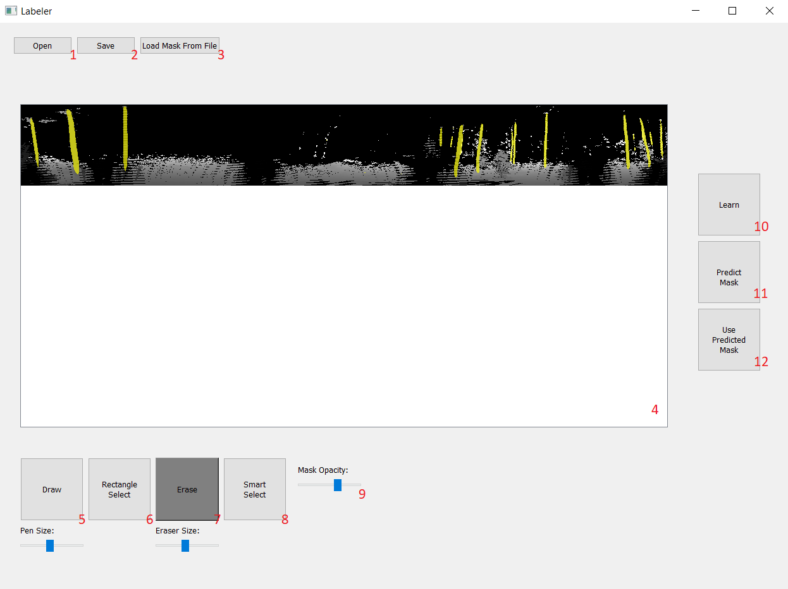
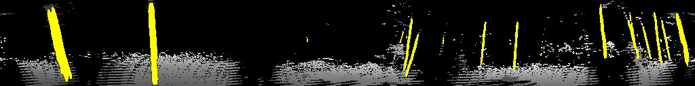
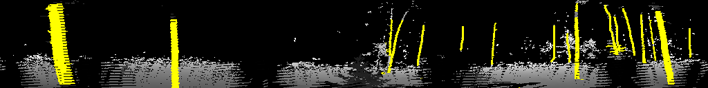

# Lidar Tree Labeling Tool

This tool is designed for annotating PCD (Point Cloud Data) to create training datasets for neural networks. It allows users to visualize lidar data, manually label trees, and use semi-automated tools to speed up the process.

## Interface Overview

### Controls

1.  **Open**: Load a new PCD file.
2.  **Save**: Save the current labels and masks.
3.  **Load Mask**: Load an existing mask from a file.
4.  **Canvas**: The main area for viewing and labeling the lidar data.
5.  **Draw**: Freehand drawing tool.
6.  **Rectangle Select**: Tool to select rectangular regions.
7.  **Erase**: Tool to remove labels.
8.  **Smart Select**: Magic wand-like tool for selecting similar regions.
9.  **Opacity**: Adjust the transparency of the label overlay.
10. **Learn**: Start training the neural network.
11. **Predict Mask**: Run the trained model on the current data.
12. **Use Predicted Mask**: Apply the model's prediction to the canvas.

## Data Examples

### Non-segmented Example

### Segmented Example

### Neural Network Segmentation Example

*Example of a tree labeled using the neural network tools.*

---

For training neural network model label your pictures or change the default dir inside NN_controls to "true_labels"

Created by Adam Pyszko
